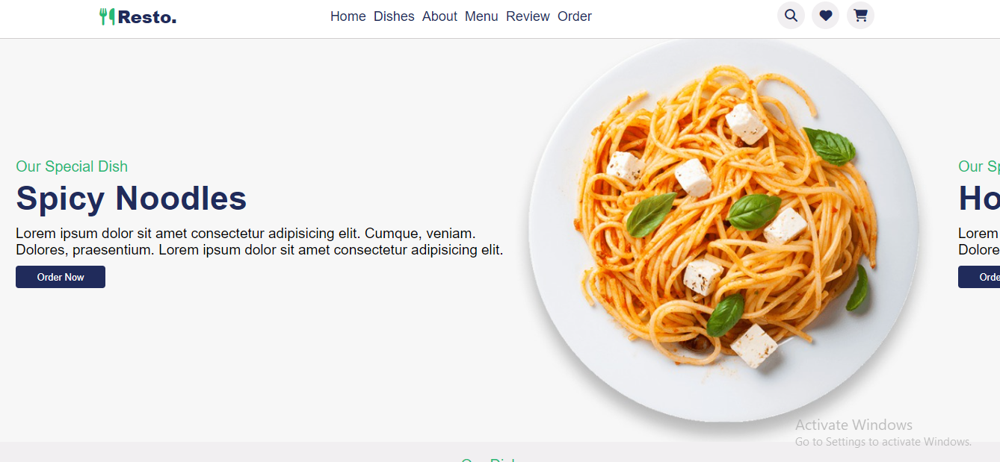
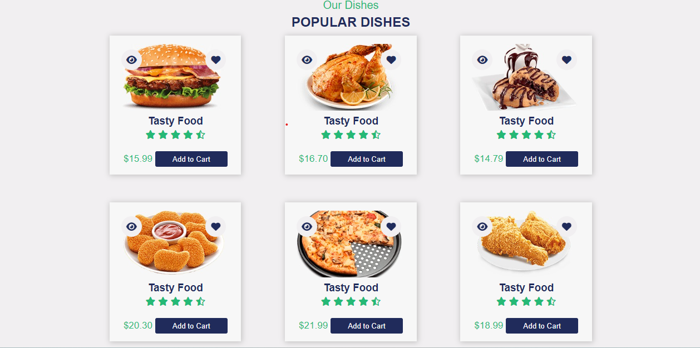
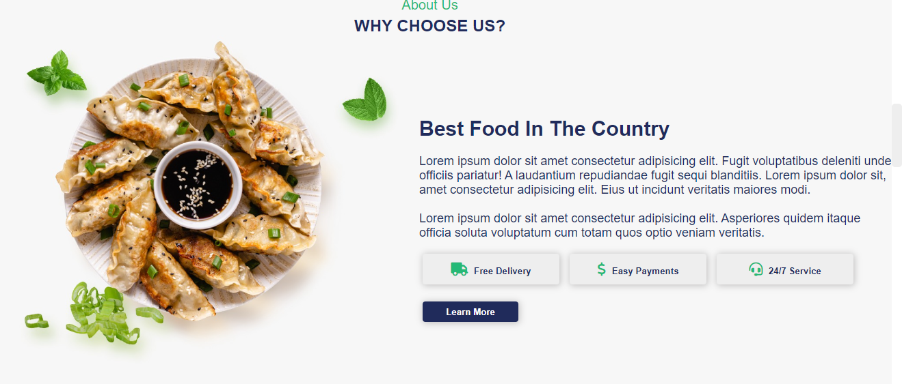
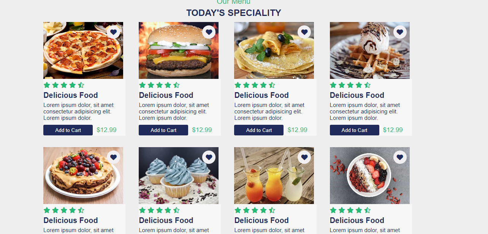
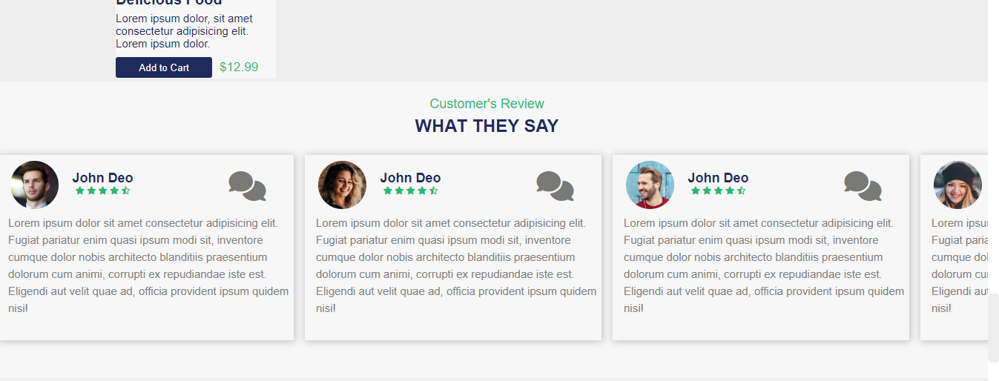
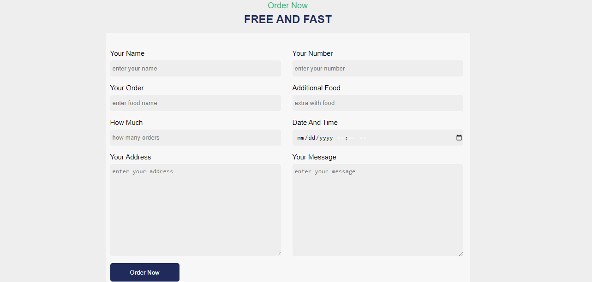

# GITHUB INDICATORS

# Resto
Hello, I createdr Restaurant page with HTML and CSS tags.

## ## RULES OF USE

> *STEP-1:*  'https://github.com/Faatiimae/Resto.git'  
> *STEP-2:*  enter the `Resto` folder that appears  
> *STEP-3:*  open the folder you are in in a text editor  
> *STEP-4:*  run the  all the`index.html` files in the main folder  
> *STEP-5:*  to download the project as `.zip`  [here](https://github.com/Faatiimae/Resto/archive/refs/heads/master.zip) click  

## Technology

This project was developed using the following technologies
 
| No | Technique | Purpose | 
| 1 | HTML | Building a project skeleton |
| 2 | CSS |  Make-up of the established skeleton |
| 3 | GIT |  Project version control management |
| 4 | VSCode | Text editor used in the project |

